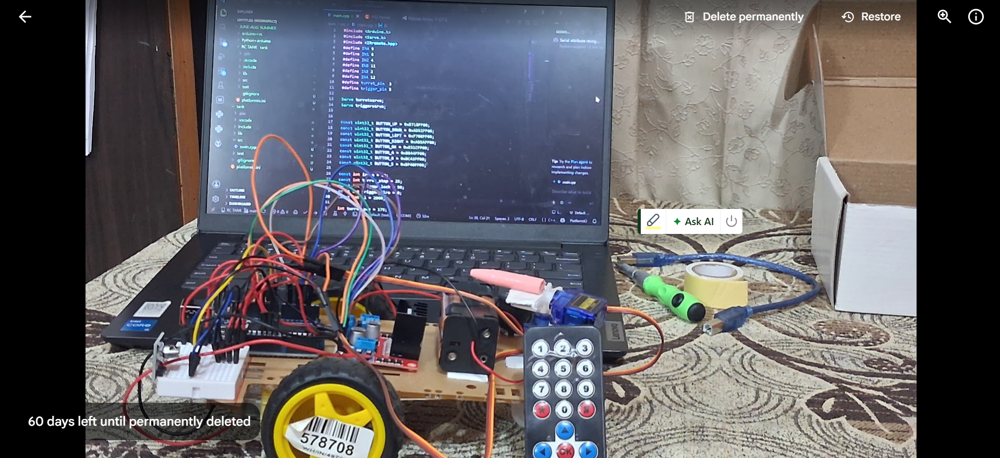
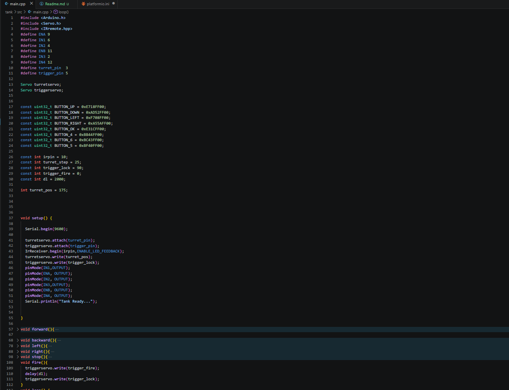
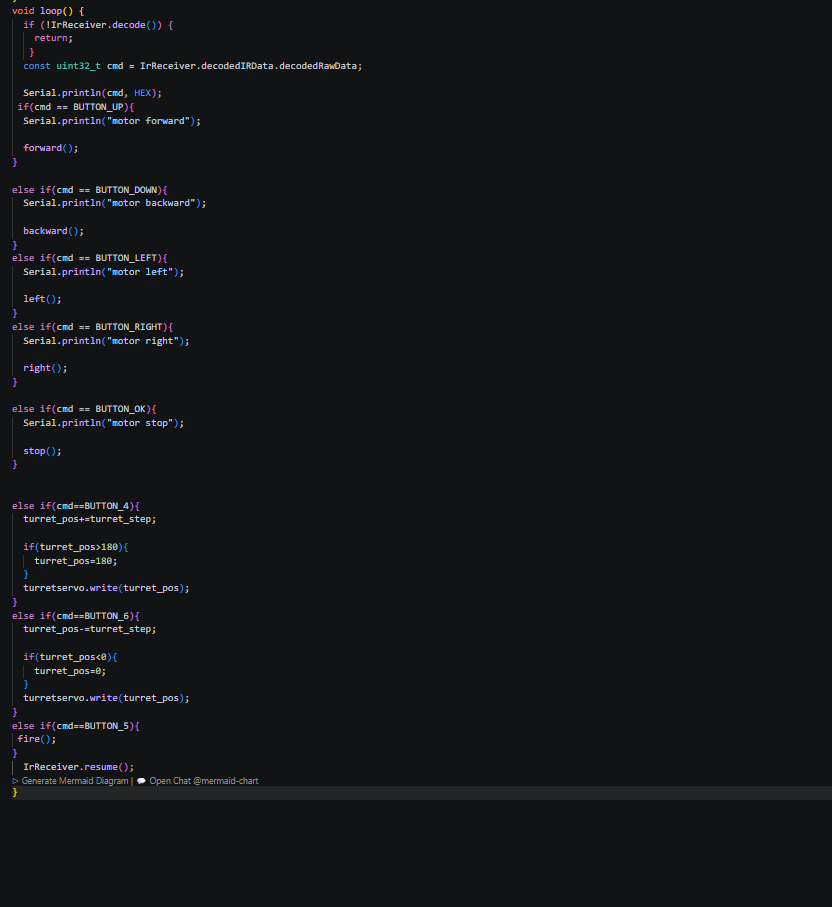
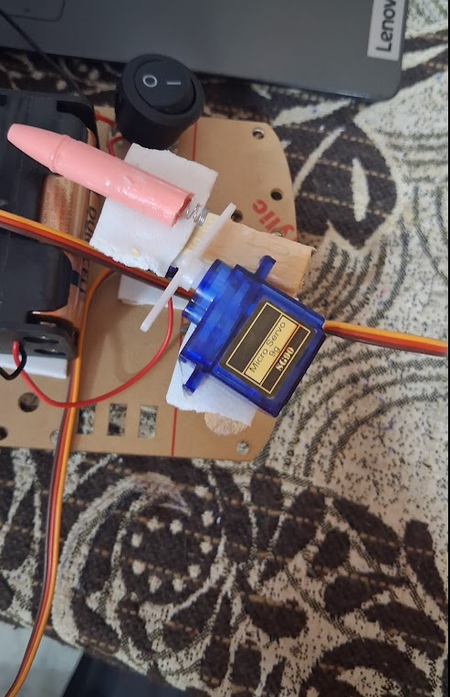
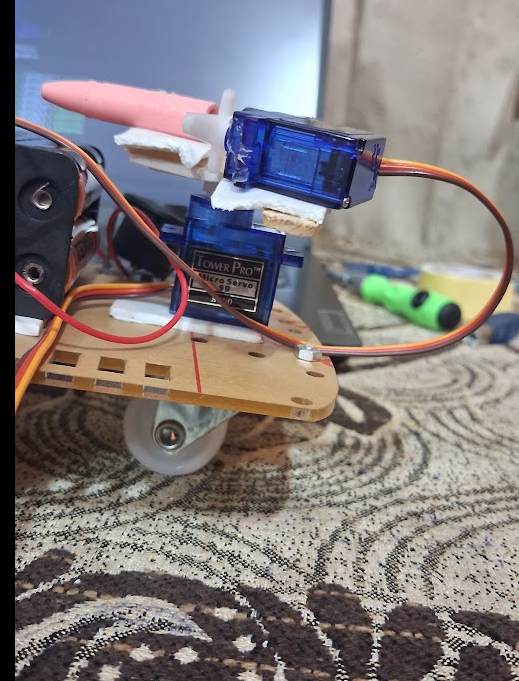
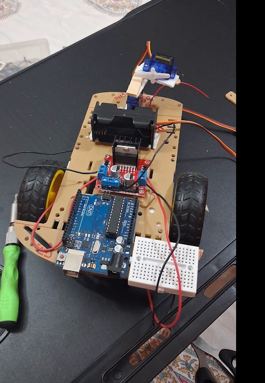

# RC Tank with Spring-Powered Launcher

A remote-controlled Arduino tank with a rotating turret and a servo-actuated spring launcher, built to learn how multiple hardware subsystems (motors, servos, IR control, power delivery) work together in a single embedded system — not as isolated modules.

---

## Demo

[Watch the demo](images/demo.mp4)


---

## Project Overview



**Stack:** Arduino UNO · L298N motor driver · 2x DC gear motors · 2x SG90 servos · IR receiver + remote · custom spring launcher

Rather than following a tutorial, I designed the launcher mechanism from scratch, integrated every subsystem, debugged the hardware failures that came up, and iterated the design across multiple builds.

---

## Why I Built This

After working with individual Arduino modules in isolation, I wanted a project where multiple components had to interact correctly at the same time — where a mistake in one subsystem (power, timing, wiring) could break another.

Specific things I wanted to learn:

- Hardware integration across multiple actuators on one controller
- IR signal decoding and command dispatch
- Power distribution and common-ground design
- Mechanical design under real constraints (torque, leverage, material limits)
- Debugging hardware failures, not just code

The goal wasn't "build an RC vehicle" — it was to understand how software, electronics, power delivery, and mechanical design constrain each other in a working system.

---

## Features

- IR remote control: forward, backward, left, right, stop
- Rotating turret (servo-driven)
- Servo-actuated spring launcher, independent of drive control
- PlatformIO project structure

---

## Components

| Hardware | Qty | Notes |
|---|---:|---|
| Arduino UNO | 1 | |
| L298N Motor Driver | 1 | |
| DC Gear Motors | 2 | |
| SG90 Servo | 2 | turret + launcher lock |
| IR Receiver + Remote | 1 | |
| Battery Holder | 1 | *[voltage/config — e.g. 4xAA / 6V]* |
| Compression Spring | 1 | *[spring constant / free length if known]* |
| Pen Tube | 1 | launcher barrel |
| Foam board, ice cream sticks, hot glue | — | chassis/launcher structure |

> **TODO:** Fill in battery voltage, motor stall current, and total tank weight. These numbers are what turned the power-distribution failures below from "vibes" into an actual diagnosis — worth having them on record.

---

## Wiring

- IR receiver → Arduino pin, VCC, GND
- L298N → motor terminals, Arduino control pins, power in
- Servo signal + power source (external supply, not Arduino 5V — see below)
- Common ground tie between Arduino and external supply

| From | To |
|---|---|
| IR Receiver VCC | 5V |
| IR Receiver GND | GND |
| IR Receiver OUT | Pin 10 |
| L298N IN1 | Pin 6 |
| L298N IN2 | Pin 4 |
| L298N IN3 | Pin 2 |
| L298N IN4 | Pin 12 |
| Turret Servo Signal | Pin 3 |
| Launcher Servo Signal | Pin 5 |

---

## How It Works

The IR remote sends commands to the Arduino, which dispatches them to three subsystems:

1. **Drive** — tank movement via the L298N motor driver
2. **Turret** — rotation via one servo
3. **Launcher** — lock/release via a second servo

The launcher holds a compressed spring inside a pen tube. A servo-controlled arm keeps it locked; on the launch command, the arm releases and the spring fires.

### Code



---

## Design Journey

### Initial Plan: Python + Arduino

The original design was Python (decision layer) → Arduino (execution) → Tank.

In practice, this meant keeping the Arduino tethered to a laptop over USB — which defeated the point of building something mobile. I dropped Python entirely and moved all control logic onto the Arduino, so the tank runs fully standalone off the IR remote.

### Building the Launcher

This was the hardest part of the project. Instead of a bought mechanism, I built one from scratch:

- Pen tube barrel
- Compression spring
- Foam supports + ice cream stick frame
- Servo-controlled locking arm

Getting a mechanism that held the spring securely *and* rotated smoothly with the turret took several redesigns.

---

## Engineering Challenges

### Power Distribution

**Problem:** Both servos and the IR receiver were initially powered from the Arduino's 5V pin. This caused missed IR commands, servo jitter, and intermittent Arduino resets under load.

**Fix:** Moved both servos to an external battery supply, tied to a common ground with the Arduino. Servo current spikes no longer brown out the logic side of the circuit.

### IR Receiver Wiring

Reversed the IR receiver's power connections during a rewire — initially assumed the Arduino itself had been damaged. Correcting the polarity fixed it immediately. Reinforced a habit: check wiring before suspecting code or a dead board.

### Servo Torque

The original launcher arm was too long, which meant too much torque was needed to actuate it and the servo struggled under load. Shortening the arm reduced the required torque and fixed reliability.

### Launcher Reliability (open issue)

Still not fully solved:

- Trigger occasionally sticks
- Launcher sometimes releases early, sometimes fails to release
- Hot glue residue interferes with smooth arm movement
- Spring force is inconsistent shot-to-shot
- Locking mechanism needs a tighter tolerance

Leaving this unresolved and documented rather than papering over it — this is the actual state of the launcher, not a rounded-off "it works."

### Wiring / Cable Management

As component count grew, the wiring turned into a mess that made debugging harder than it needed to be. Lesson: cable management isn't cosmetic — it directly affects how fast you can isolate a fault.

---

## What I Learned

- Hardware integration across multiple actuators on a shared controller
- Servo and DC motor control
- IR signal decoding
- Power budgeting and common-ground design
- Mechanical design under torque/leverage constraints
- Debugging hardware faults vs. software faults
- Iterative mechanical redesign
- PlatformIO project structure

The core lesson: real engineering rarely lives in code alone. Mechanical, electrical, and software decisions all constrain each other, and a failure in one usually shows up as a mystery in another.

---

## Current Limitations

- Trigger mechanism needs refinement
- Wiring needs a cleanup pass
- Launcher lock reliability is inconsistent
- Servo torque is near its practical ceiling for this arm length
- Handcrafted parts, not machined — tolerances vary

---

## Future Improvements (v2)

- Redesigned launcher locking mechanism with tighter tolerances
- Stronger, more durable chassis
- Cleaner wiring / possible harness or PCB
- Dedicated regulated power supply (separate from drive battery)
- Better weight distribution
- Additional sensors
- Computer vision integration
- Autonomous navigation

---

## Gallery

### Final Build


### Launcher
| Top View | Side View |
|---|---|
|  |  |

### During Development


---

## Repository Structure

```text
tank/
│
├── images/
│   ├── demo.mp4
│   ├── final-tank.png
│   ├── launcher-top.png
│   ├── launcher-side.png
│   └── tank-in-work.png
│
├── include/
├── lib/
├── src/
│   └── main.cpp
│
├── platformio.ini
└── README.md
```

---

## Final Thoughts

This project isn't fully solved, and that's on purpose. The value wasn't getting the tank to move — it was understanding *why* things failed (power delivery, servo torque, mechanical tolerances) and fixing them one at a time.

It's a solid foundation for the next iteration: cleaner power design, a more reliable launcher, and eventually sensing and autonomy on top of the same base.